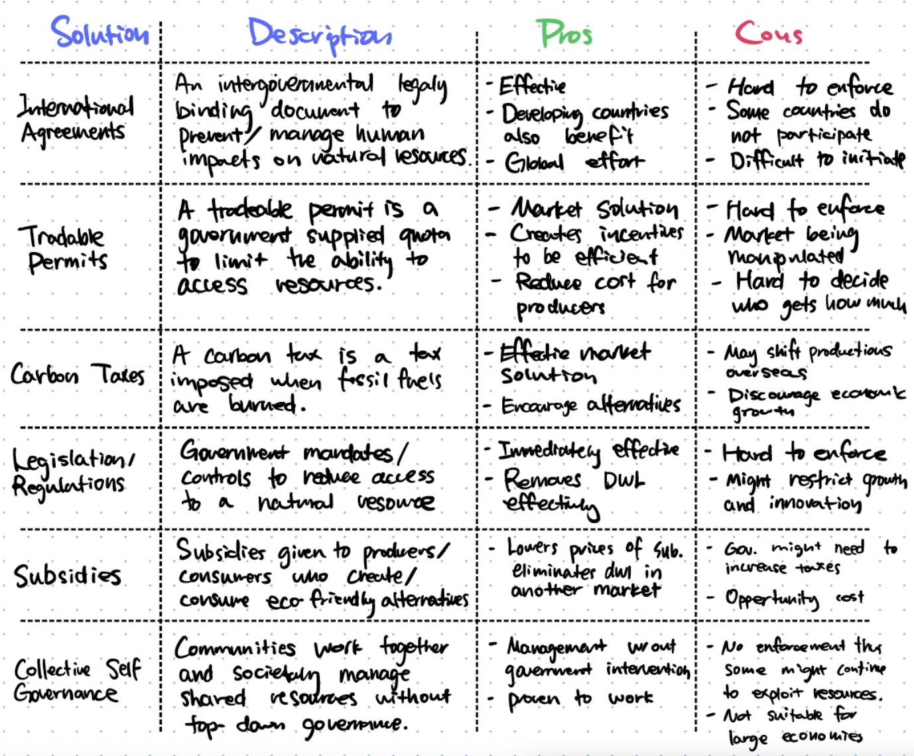

# Market Failure

Notes, Key Points, Paper 2 Tips & Sample Questions

## Summarized Notes

### Taxes & Subsidies

#### Taxes

-   Governments impose indirect tax to create government revenue, discourage consumption of certain demerit goods, to redistribute income and a method of improving the allocation of resources.
-   When a specific tax is imposed, consumers pay more and consume less. Producers receive less revenue and sell less products/services. The government receives tax revenue and workers receive lower wages due to reduced total producer revenue. Society as a whole loses allocating efficiency. However, it can be compensated.

#### Subsidies

-   Governments provide subsidies for three main reasons: Lower price of an essential good, guarantee supplies that are necessary and enable producers to compete with overseas trade.
-   When evaluating a subsidy, the opportunity cost from providing other firms subsidies, damage done to foreign producers, players paying taxes and the efficiency/decreased incentive created.

### Price Controls

#### Price Ceilings

-   Governments impose price ceilings to help consumers obtain necessity and merit goods at a cheaper price.
-   There can be consequences caused by price ceilings aside from a shortage in the market. Price ceilings can create an underground market, create queues for producers and cause unfairness in distribution of limited goods.
-   When a price ceiling is imposed, consumers partly gain and partly lose where some consumers gain extra surplus by purchasing the product at a lower price. However, the shortage caused other consumers to have no access at all to the product or service and remain unsatisfied. Society experiences a loss in allocating efficiency (deadweight loss). Workers might get fired due to a reduction of quantity supplied and loss in total producer revenue. Governments do not gain nor lose economically but can gain political popularity amongst consumers who benefitted.
-   To eliminate or reduce the shortage caused by a price ceiling governments can: find ways to reduce demand for a product but this limits the consumption of a product, find ways to increase the supply of the product through subsidies and direct provision.

#### Price Floors

-   Price floors are imposed to raise income for producers of goods and services that the government thinks are important and to protect workers by setting a minimum wage that ensures they can live a reasonable life. Some examples of price floors are minimum wages for workers, minimum prices for agricultural goods and minimum prices for alcohol.
-   Price floors will create inefficiency due to a surplus. Governments can use the following four ways to address the surplus: buying up the surplus (store, destroy or sell to other countries), increasing demand through advertising, restricting overseas imports or imposing a producer quota.
-   A minimum wage is a type of price floor, the minimum price for a market of a factor of production: labour. A minimum wage can increase income for low-paid workers, increase labour productivity, offset employer power-imbalance and increase incentive for people to enter the labour market. However, a minimum wage can cause unemployment in competitive markets, encourage the creation of informal/illegal labour markets, destruction of small businesses and higher prices for firms to pass on to consumers.

### Negative & Positive Externalities

-   When society doesn't take into account externalities, it leads to market failure.

#### Negative Externalities

-   Negative externalities of production is a cost that is suffered by a third party as a result of production of a good or service. An example would be the production of steel where toxic chemicals are produced for society.
-   When negative externalities of production are not recognized, an overproduction of that good or service will cause allocating inefficiency or welfare loss. There will be two optimums: the market equilibrium and the social equilibrium where it's the social optimum. In this situation, no party can benefit more without harming another by changing its production/consumption.
-   Solutions to negative production externalities are government regulation for producers, indirect taxations or a market for the externality.
-   Tradable permits can be issued to firms to create a market for pollution. This creates a quota for each firm on their pollution and incentives firms to pollute less since permits can be sold for money.
-   Negative externalities of consumption happen on the consumer side where consumers harm others by consuming more of a product or service, such as smoking.
-   An overconsumption will happen and cause deadweight loss which leads to allocative inefficiency. In the case of demerit goods, they are overproduced by the market and over-consumed by consumers because they often have unrecognized negative externalities of consumption and people just don't care about the harmful effects upon themselves and others.
-   To combat negative consumption externalities, governments can create legislation banning or reducing consumption, imposing taxes for certain demerit goods, provide education/advertisement to society or use consumer nudges to make consumers voluntarily reduce consumption.

#### Positive Externalities

-   Positive externalities is when the side-effect on a third party that's not a producer or a consumer that pays to consume a product or service is beneficial.
-   When a firm produces a good or service and there is a positive benefit to third parties such as society a positive externality of production is present. This often leads to a situation where the cost to the private individuals is higher than the cost to society and creates an underproduction of said product or service which leads to deadweight loss or potential welfare gain.
-   To combat positive externalities of production, governments can directly provide the good or service through direct provision or provide subsidies to firms.
-   Positive externalities of consumption are benefits to third parties when a good or service is consumed. This leads to a situation where the benefit to society is greater than the benefit to the private consumer thus an under-consumption often happens. This also causes deadweight loss or potential welfare gain.
-   In the case of merit goods, they are often services that benefit society as a whole more than the consumer such as education, healthcare, sport facilities etc. They are often under consumed because of a lack of recognition, low levels of income and poverty and blatant consumer ignorance.
-   To combat positive externalities of consumption, governments can create legislation to consume more, positive advertising, direct government provision for certain products or services or subsidies.

### Common Pool Resources & Public Goods

#### Common Pool Resources

-   Common pool resources are non-excludable and rival and that's why the main consequence in the absence of government intervention is resource degradation.
-   Common pool resources are very susceptible to negative externalities (both production and consumption) because they are non-excludable so overconsumption/overproduction will occur.
-   The tragedy of the commons refers to the consequences of non-excludability of common resources. When a party simply "losses" in self-interest if one does not consume more of a common pool resource which causes exhaustion of limited resources.
-   The free rider problem is when parties consider society as a whole and do not act upon self-interest, other "free riders" will simply consume/produce more of the common pool resources with no consequences.
-   To combat the tragedy of the commons International agreements, tradable permits, carbon taxes, legislation/regulations, subsidies and collective self governance are often used.
-   

#### Public Goods

-   Public goods often cause market failure because there is no profit incentive and usually can't be provided by any market. Some examples are street lights, breathable air, lighthouses and national defense.
-   Public goods have two key characteristics of being non-excludable and non-rival. One cannot reasonably stop another from using the resource and when one person uses the good, others can still use the good.
-   To combat the issue of public goods, governments often resort to direct provision or heavy subsidies or work in partnership with firms in the private sector.

### Asymmetric Information

-   Asymmetric information refers to a situation when one party to an economic transaction possesses greater material knowledge than the other party.
-   Asymmetric information often causes market failure due to two reasons: Uncertainty of the buyer will drive prices down across the whole market. This will further cause the market to collapse and no trade will occur at any price point.
-   Due to asymmetric information, when consumers know more than the producers, there will be a selection of who to provide a good/service to, or there will be a price raise since consumers who need the good/service to will use it more (ie. less healthy people and health insurance)
-   An example of adverse selection would be insurance companies choosing who to sell their product to or creating unreasonable prices for people who the company thinks is not safe to sell the product in an attempt to scare them away from purchasing.
-   The most important way to combat asymmetric information is signalling. For example sellers are required to tell buyers the condition of each car, life insurance companies require customers to do health checkups before selling them products etc.
-   Moral hazards are situations where one person is trying to get another person to behave in a certain way but if the first person cannot observe the second person's work and the second person needs to put effort into said work, the second person can simply avoid work.
-   Both moral hazards and adverse selection can cause market failure. In the case of adverse selection, the market failure occurs before an economic transaction has been made. One party has more information than the other, and this gives the party an advantage going into the transaction. In the case of moral hazard, the market failure occurs after the economic transaction has been made. The party with greater knowledge of the risk has the advantage following the transaction.

## Definitions List

-   Indirect Tax
    -   Tax imposed on spending to buy goods and services. Paid by the producer (firms) but are partially passed to the consumer.
-   Excise Taxes
    -   Tax on a specific good and services
-   Specific Taxes
    -   A type of excise tax of a fixed dollar amount
-   Ad Valorem Taxes
    -   A type of excise tax of a fixed percentage amount
-   General Taxes
    -   Taxes on all (or most) goods and services
-   Subsidy
    -   An amount of money paid by the government to a firm, per unit output, to increase output and lower price.
-   Price Controls
    -   A minimum or maximum price set by the government such that prices are unable to adjust to equilibrium level
-   Price Ceilings
    -   A maximum price for a good or service set by the government
-   Price Floors
    -   A minimum price for a good or service set by the government
-   Merit Good
    -   Goods or services that are beneficial to consumers and also beneficial to society when consumed. Merit goods are often underproduced.
-   Underground Market / Black Market
    -   An illegal market in which a good/service is sold at a higher price, somewhere between the price ceiling and the equilibrium price.
-   Quota
    -   A quota is a quantity restriction on the amount of goods that can be produced in a market.
-   Market Failure
    -   Market prices fail to reflect all the costs and benefits involved in transactions and thus the market cannot reach allocative efficiency.
-   Externalities
    -   When some costs or benefits associated with the production or consumption of a good/service "spill over" to third parties who do not produce or pay to consume the good/service.
-   Positive Externality
    -   A type of externality where benefits are enjoyed by someone who doesn't pay to consume or produce a good or service.
-   Negative Externality
    -   A type of externality where costs are paid by someone who doesn't produce or pay to consume a product or service.
-   Marginal Private Cost (MPC)
    -   The cost to producers of producing one more unit of a good or service
-   Marginal Social Cost (MSC)
    -   The cost to society of producing one more unit of a good or service. MSC includes production and external cost.
-   Marginal Private Benefit (MPB)
    -   The benefit to consumers from consuming 1 more unit of a good or service.
-   Marginal Social Benefit (MSB)
    -   The benefit to society from consuming 1 more unit of a good or service.
-   Social Optimum/Allocative Efficiency
    -   The state of the market when all costs and benefits are aligned.
-   Demerit Goods
    -   Demerit goods are goods that are undesirable for consumers and society but over provided by the market.
-   Common Pool Resources
    -   Natural resources that are non-excludable and rival.
-   Non-excludable
    -   One cannot reasonably or cost effectively prevent someone else from using a resource.
-   Rival
    -   A situation where one party's use of the good diminishes another parties ability to use it.
-   Sustainability
    -   Maintaining the ability of the environment and the economy to continue to produce and satisfy the needs and wants of future generations.
-   Public Good
    -   Goods that are to become freely available to all or where it would be difficult to prevent non-payers from using.
-   Asymmetric Information
    -   Refers to a situation when one party to an economic transaction possesses greater material knowledge than the other party.
-   Adverse Selection
    -   The situation where sellers select who to provide a good or service to due to asymmetric information.
-   Moral Hazard
    -   Moral hazard is a situation in which one party gets involved in a risky event knowing that it is protected against the risk and the other party will incur the cost. It arises when both the parties have incomplete information about each other.

## Paper 2 Writing Tips

Data response test → Newspaper articles, readings etc.

#### Question 1

> 4 marks 5 min 😄

1 or 2 sentences maximum for full marks.

1. A **vague** definition for 1 mark 📉
2. A **precise** definition for 2 marks 📈

#### Question 2 & 3

> 8 marks total, 4 each 😍

Diagram + written response (explaining the diagram and analyzing). 😡 Always read the text before responding referring to the diagram and text.

" **Using a market failure diagram** , **illustrate** and **explain** how the vaccines market can be an example of market failure"

#### Question 4

> 8 marks 🥵

Evaluate + Synthesis

**To evaluate:**

-   Have a conclusion statement, paragraph form.
-   Conclusion should "weigh" the evidence (show both sides).
-   "On the one hand…, on the other hand…, overall…"

**Look at:**

-   Stakeholders
-   Pros/cons
-   Short run/long run
-   Priorities

**ALWAYS** :

-   Refer to paragraph numbers from the text
-   Quote from the text

## Review Questions

1. Discuss the significance of price elasticity of demand (PED) for a government imposing an indirect tax on a good.
2. Explain two reasons why a government might impose an indirect tax on a good.
3. Evaluate the impact that an increase in indirect tax might have on consumers and producers.
4. A government decides to impose an indirect tax on unhealthy drinks. Discuss the consequences for the stakeholders in these markets.
5. Discuss the view that governments should tax the consumption of gasoline (petroleum).
6. Explain how the incidence of an indirect tax depends on the price elasticity of demand and the price elasticity of supply.
7. Discuss the consequences of imposing an indirect tax on unhealthy food.
8. Explain why a government might decide to impose an indirect tax on the consumption of cigarettes.
9. Discuss the possible consequences of the imposition of an indirect tax on cigarettes for the different stakeholders in the market.
10. Discuss the consequences of the introduction of an indirect tax on gasoline (petrol) for consumers, producers and the government.
11. Explain two reasons why governments impose indirect taxes.
12. Discuss the consequences for consumers, producers and the government of imposing a specific tax on cigarettes.
13. Explain why governments impose indirect taxes.
14. Using diagrams, explain how the incidence of an indirect tax may be affected by the price elasticity of demand.
15. Discuss the view that the provision of subsidies by the government on goods such as agricultural products will always be beneficial to stakeholders.
16. Explain two reasons why a government might want to subsidise a good or service.
17. Explain why governments provide subsidies for some goods and services.
18. Discuss the consequences of providing a subsidy for goods such as agricultural products
19. Discuss the consequences for different stakeholders in the economy of the government providing subsidies on goods, such as renewable energy.
20. Explain two reasons why governments might subsidise basic food such as wheat.
21. Discuss the consequences for the government and for consumers of subsidising the price of admission to museums.
22. Discuss the consequences of providing a subsidy on the production of rice for producers, consumers and the government.
23. Explain why a government might decide to impose a price ceiling on goods and services such as essential foods or rented housing.
24. Discuss the view that price controls imposed by governments on the market for rented housing should never be used.
25. Explain why governments impose price floors (minimum prices)
26. Discuss the consequences for producers, consumers and the government of imposing a price floor (minimum price) on a good.
27. Discuss the impact on different stakeholders of governments using price floors (minimum prices) to support farmers when agricultural prices are falling.
28. Examine the possible consequences of governments imposing a price ceiling in the market for rented housing.
29. Discuss possible consequences of a government imposing a price floor on an agricultural product.
30. Using a price ceiling diagram, analyse the impact a maximum price might have on the market for food.
31. Explain why a government might impose a price ceiling on the market for rented accommodation and a price floor on the market for agricultural products.
32. Evaluate the possible consequences of price controls on the stakeholders in a market.
33. Discuss the view that governments should not intervene in housing markets.
34. Discuss the policies a government might use to make food more affordable to low income groups.
35. Examine the view that the best allocation of resources, from a society's point of view, occurs where the marginal private benefit equals the marginal private cost.
36. Discuss the view that competitive markets will always achieve allocative efficiency.
37. Discuss the view that a free market at competitive market equilibrium leads to the most efficient allocation of resources from society's point of view.
38. Negative externalities of production and consumption
39. Using an appropriate externalities diagram, explain why a government might decide to impose a price floor on a demerit goods.
40. Evaluate the view that the most effective way in which the government can discourage the consumption of demerit goods is through government regulations.
41. Discuss the view that imposing an indirect tax on gasoline (petrol) is the most effective way of reducing the market failure caused by cars.
42. Evaluate the view that the use of regulation is the most effective way to reduce negative externalities.
43. Explain why demerit goods are an example of market failure.
44. Evaluate the effectiveness of using indirect taxation to correct market failure.
45. Evaluate the view that regulations are the most effective government response to the market failure of negative externalities.
46. Evaluate the view that the market failure caused by the consumption of demerit goods is best dealt with through the use of taxation.
47. Discuss three policies a government might use to reduce the consumption of a demerit good such as cigarettes.
48. Using a diagram, explain why demerit goods are considered to be an example of market failure.
49. Evaluate two possible government responses that could be used to address the problem of demerit goods.
50. To what extent might the problems of negative externalities of consumption be resolved by the use of indirect taxation?
51. Positive externalities of production and consumption
52. Evaluate the view that the most effective way in which the government can encourage the consumption of merit goods is through direct provision.
53. Explain why public transport, such as buses and trains, might be under-provided in a market economy.
54. To what extent is advertising the most effective way of increasing the consumption of merit goods?
55. Explain why the consumption of merit goods, such as healthy food, can lead to positive externalities of consumption.
56. Discuss whether advertising by the government is the most appropriate way of increasing consumption of a merit good.
57. Explain why the under-consumption of merit goods causes market failure.
58. To what extent are subsidies the most effective way of encouraging the consumption of merit goods?
59. Analyse the private and external benefits associated with the consumption of university education.
60. Explain the policies a government might use to increase the consumption of university education.
61. Analyse the consumption externalities which might arise from the provision of education and healthcare for the citizens of a country.
62. Evaluate the use of government policies to increase the consumption of healthcare.
63. Discuss the implications of the direct provision of public goods by a government.
64. Discuss the consequences of the direct provision of public goods by the government.
65. Discuss whether there should always be direct provision of public goods by the government.
66. Explain why the exploitation of common access resources, such as uncontrolled fishing, might pose a threat to sustainability.
67. Evaluate whether the use of carbon taxes is the most effective way for the government to deal with the threat to sustainability posed by the use of fossil fuels.
68. Explain how the overuse of common access resources can lead to negative externalities
69. Discuss the view that the best way to reduce the threat to sustainability, arising from the burning of fossil fuels, is for the government to provide subsidies to
70. firms that produce energy through renewable resources.
71. Examine the consequences of the lack of a pricing mechanism for common access resources.
72. Discuss the view that the overuse of common access resources is best addressed by the government.
73. Discuss two possible government responses to threats to sustainability.
74. Explain why common access resources, such as fishing grounds, might become depleted in the absence of a price mechanism.
75. Explain why monopoly power may be considered a type of market failure.
76. Discuss the view that legislation is the best way of dealing with the problem of monopoly power.
77. Oligopolists often possess too much monopoly power. Evaluate whether governments should intervene in oligopolistic markets.
78. Explain two possible government responses to the abuse of monopoly power.
79. Explain how welfare loss may result from monopoly power.
80. Discuss the effectiveness of government policies (legislation and regulation) to reduce monopoly power.
81. Market failure can occur when there is asymmetric information, abuse of monopoly power and positive externalities. Explain why any two of these represent market failure.
