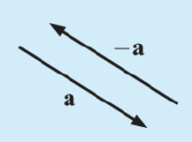
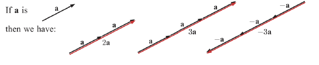
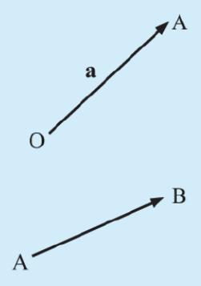
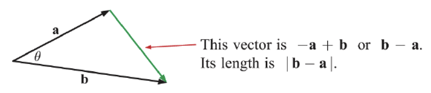
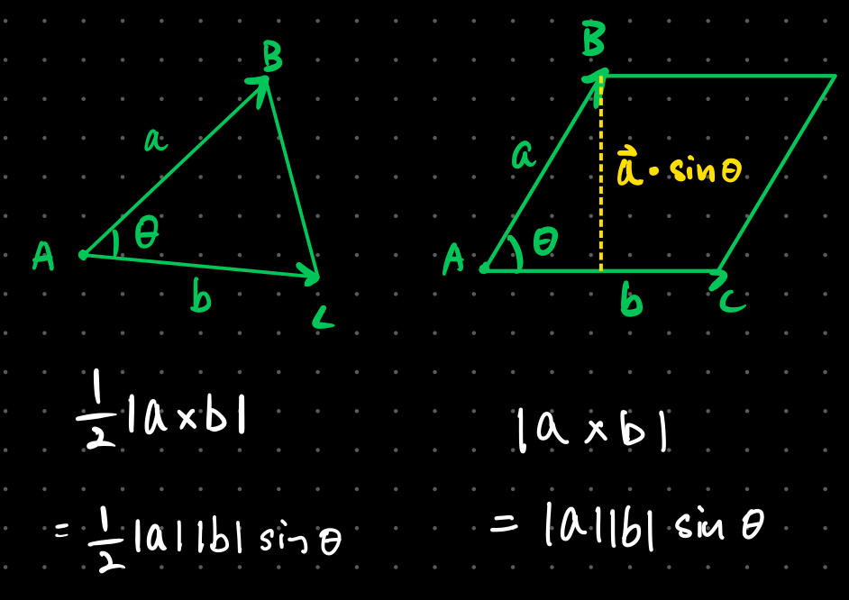
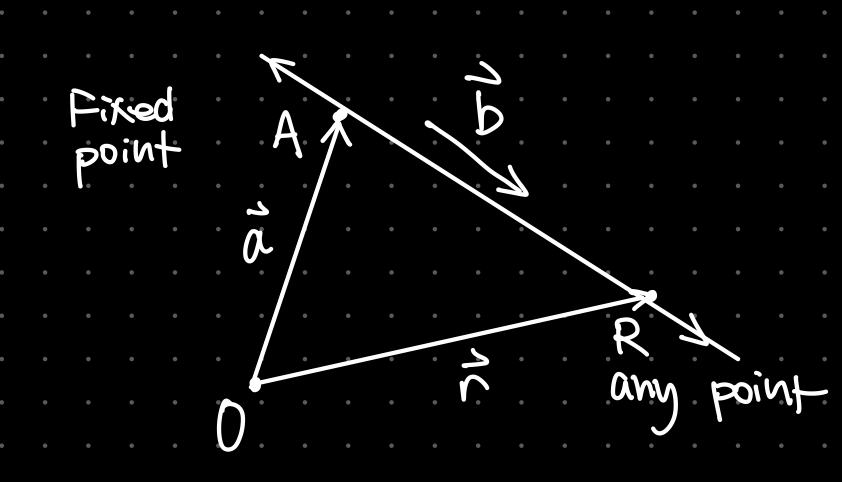

# Vectors

A vector is a mathematical way to describe a "journey" with two components: a **magnitude** and a **direction**. As opposed to a scaler value which only has a magnitude.

A vector can be represented using directed line segments where the length shows the magnitude and the arrow indicates the direction.

Two vectors are the same only when they have the same magnitude **and** direction. A negative of a vector is a vector parallel, same length but opposite in direction denoted as $-\vec{a}$  

#### Vector Addition

Vector addition is _Head-to-Tail_ where one vector is place at the end of another. The resultant vector starts from the start of the first vector and ends at the end of the second vector.

#### Vector Subtraction

Vector subtraction can be considered _Tail-to-Tail_ but you can also find the negated value of the second vector and do [vector addition](#vector-addition).

#### Scalar Multiplication

Scalar multiplication is multiplying a scalar value to a vector. It multiplies the magnitude of the vector of the scalar amount and changes the direction if the scalar is negative.

### Representing Vectors in a Plane

#### Notation

**Unit vector**: A normalized vector of magnitude 1  
**Position Vector**: The position vector of point P is a vector originating from the origin and ending at point P(x,y).  
**Displacement Vector**: The displacement vector of B relative to A $\vec{AB}$ is a vector that originates from A and terminates at B.  

Vectors are often denoted using a lower case letter with a hat like such $\vec{a}$ or the two points the vector originates and ends at like $\vec{AB}$

Vectors on a plane can also be represented as the two components like such:

$$
\begin{bmatrix}
x \\
y \\
\end{bmatrix} = xi+yj
$$

Where $i$ is the x unit vector $\begin{bmatrix} 1 \\ 0 \\  \end{bmatrix}$ and $j$ is the y unit vector $\begin{bmatrix} 0 \\ 1 \\  \end{bmatrix}$.

Generally we can represent a vector as $\begin{bmatrix} x \\ y \\  \end{bmatrix}$ where $x$ is the horizontal component and $y$ is the vertical component of the vector.

The magnitude or length of that vector is written as $|\vec{AB}|$ or $|\vec{a}|$. It's found using formula:

$$
\sqrt{{a_1}^2+{a_2}^2+...+{a_n}^2}
$$

where $a_n$ is each component of the vector.

#### Operations

If $a=\left(\begin{array}{l}a_{1} \\ a_{2}\end{array}\right)$ and $\mathbf{b}=\left(\begin{array}{l}b_{1} \\ b_{2}\end{array}\right)$ then $\mathbf{a}+\mathbf{b}=\left(\begin{array}{l}a_{1}+b_{1} \\ a_{2}+b_{2}\end{array}\right)$

If $\mathbf{a}=\left(\begin{array}{l}a_{1} \\ a_{2}\end{array}\right)$ and $\mathbf{b}=\left(\begin{array}{l}b_{1} \\ b_{2}\end{array}\right)$, then $\mathbf{a}-\mathbf{b}=\left(\begin{array}{l}a_{1}-b_{1} \\ a_{2}-b_{2}\end{array}\right)$

If $k$ is any scalar and $\mathbf{v}=\left(\begin{array}{l}v_{1} \\ v_{2}\end{array}\right)$, then $k \mathbf{v}=\left(\begin{array}{l}k v_{1} \\ k v_{2}\end{array}\right)$

## Scalar Product & Angle Between Two Vectors

The scalar product of two vectors is also knows as the dot product or inner product. It's found by multiplying each of a vectors compoments and summing them up like such:

$$
\left(\begin{array}{l}
a_{1} \\
a_{2} \\
a_{3}
\end{array}\right) \cdot\left(\begin{array}{l}
b_{1} \\
b_{2} \\
b_{3}
\end{array}\right)=a_{1} b_{1}+a_{2} b_{2}+a_{3} b_{3}
$$

The angle between two vectors $\theta$ is the angle between two vectors, we can find the angle using the cosine rule:

$$
|b-a|^2 = |a|^2 + |b|^2 + 2 |a||b|\cos{\theta} \\
\cos{\theta} = \frac{a\cdot b}{|a||b|}
$$

> Note: Vectors must be converging or diverging from the same point to have an angle between them

### Implications

The implications of the dot product indicates how close the two vectors are. In this case:

$$
\begin{aligned}
\vec{a}\cdot \vec{b}=0,\ \cos \theta =0,\ \theta =90^{\circ }\\
\vec{a}\cdot \vec{b}=\left| a\right| \left| b\right| ,\ \cos \theta =1,\ \theta =0\\
\vec{a}\cdot \vec{b} >0, \cos \theta  >0\\
\vec{a}\cdot \vec{b} <0, cos\theta  <0,
\end{aligned}
$$

As shown, if the dot product of the two vectors equal to 0, they are perpendicular to each other. If the dot product is equal to the two magnitudes of the vectors, they are parallel. If the product is greater than 0, the angle os acute and if they are less than 0, they angle between them is obtuse.

## Vector Product

The vector product or the cross product is only defined for 3-dimensional vectors. The vector product or the cross products results in **a** vector which is perpendicular to the two known vectors.

$$
a=\begin{bmatrix}
a_{1} \\
a_{2} \\
a_{3}
\end{bmatrix},b=\begin{bmatrix}
b_{1} \\
b_{2} \\
b_{3}
\end{bmatrix},a\times b=\begin{bmatrix}
a_{2}b_{3}-a_{3}b_{2} \\
a_{3}b_{1}-a_{1}b_{3} \\
a_{1}b_{2}-a_{2}b_{1}
\end{bmatrix}
$$

An easy way to remember the operation is split into 3 steps:

1. Cover row 1 and start a cross with the remaining 4 elements of the two vectors. Start from Upper Left.
2. Find the difference between the two products of the cross (starting from upper left)
3. Cover row two and invert cross with remaining 4 elements. Starting from Bottom Left. Find difference.
4. Cover row 3 and return to starting from Upper Left when drawing the cross. Find the difference.

### Properties of the Cross Product

1. $a\times b$ is a vector perpendicular to $a$ and $b$
2. $a\times a=0$ for all $a$
3. $a\times b = (-b)\times a$ for all $a$ and $b$
4. $a\cdot (b\times c)$ is the scalar triple product
5. $a\times (b+b)=a\times b+a\times c$
6. $\left( a+b\right) \times \left( c+d\right) =a\times c+a\times d+b\times c+b\times d$

### Geometric Interpretation

Using the cross product, we can find the area of a trangle or parallelogram without knwoing the angle between the two vectors due to:

$$
|a\times b| = |a||b|\sin(\theta)
$$

where we know the area of a traingle is $\frac{1}{2}ab\sin(\theta)$ thus the area of a trangle and a parallegorm is found.

## Vector Lines

> **Recall**: the equation of a line is defined as $y=mx+b$ where $m$ defines the slope and $b$ defines the position

A similar process can be done using vectors where one vector defines the "slope" or the direction and another positional vector shows the position.

Suppose a line passes through a fixed point A with position vector $\vec{a}$ and the line is parallel to the vector $\vec{b}$.  
Now consider a point $R$ on that line with a position vector $\vec{r}$. By vector addition, we know that $\vec{r}=\vec{a}+\vec{AR}$
  
Since $\vec{AR}$ is parallel to $\vec{b}$ we can say that

$$
\vec{AR}=\lambda \vec{b}
$$

Where $\lambda \epsilon \mathbb{R}$ is some scalar multiple. Thus

$$
\vec{r} = \vec{a} + \lambda \vec{b},\ \lambda \epsilon \mathbb{R}
$$

is the vector equation for a line. Here vector $a$ represents a position and vector $b$ defines the direction.

The vector equation fo a line is not unique. Any position vector of a point on the line can be used as the position vector $\vec{a}$ and any vector parallel can be the direction vector $\vec{b}$.

In conclusion, using the vector equation of a line, we can plug in any lambda and it will generate points on the line.

### Different Forms of Representing Vector Lines

#### Vector Equation

$$
\begin{pmatrix}
x \\
y \\
z
\end{pmatrix}=\begin{pmatrix}
a_{1} \\
a_{2} \\
a_{3}
\end{pmatrix}+\lambda \begin{pmatrix}
b_{1} \\
b_{2} \\
b_{3}
\end{pmatrix}
$$

#### Parametric Equation

$$
\begin{cases}x=a_{1}+\lambda b_{1}\\
y=a_{2}+\lambda b_{2}\\
z=a_{3}+\lambda b_{3}\end{cases}
$$

#### Cartesian Equation

By isolating $\lambda$ from the parametric equation:

$$
\dfrac{x-a_{1}}{b_{1}}=\dfrac{y-a_{2}}{b_{2}}=\dfrac{z-a_{3}}{b_{3}}
$$

> **Be Carefull**: Make sure that the form matches exactly in a question, for instance if the x component is $\frac{5-x}{6}$ the $b_1$ value is $-6$ and not $6$

### Angle Between Two Lines

To find the acute angle between two vector lines where $\cos(\theta)$ is always greater than 0, we just find the angle between the two directon vectors of the equation using the formula found earlier:

$$
\cos(\theta) = \frac{|b_1\cdot b_2|}{|b_1||b_2|}
$$

## Intersection of 2 Vector Lines

## Equation of a Plane

## Intersection of a Line & Plane
