# Eectricity and Magnetism

## Electric Fields

### Charge

Electric charge can either be positive or negative.

Charges with the same sign repel each other and changes with the opposite sign attract.

An object with equal amounts of positive change and negative charge is said to be electrically neutral.

The unit of electric charge is coulomb (C).

The charge of one electron is equal to 1.6\*10^-19C.

Electric charge is always conserved. While charges could migrate from one body to another, the total charge remains the same.

Conductors are materials which allow the passage of electric charge. This is due to the presence of free electrons in solid conductors.

-   Examples of conductors include all metals, graphite, humans.

Insulators are materials which do not allow the passage of electric charge.

-   Examples of insulators include wood, glass, and plastic buckets.

### Electric Field

Electric fields can be graphically represented as electric field lines.

-   The direction of the field at a point is equal to the direction of the field line passing through that point (arrows from the positive pole to the negative pole).
-   The magnitude of the field at a point corresponds to the density of the field lines around that point. For a uniform electric field, the field lines are straight, parallel and equally spaced.

Non-uniform electric field

Uniform electric field

The electric field lines curve outwards near the edge of the plates. This is known as the “edge effect”.

Electric field strength (E) is the force per unit charge experienced by a positive test change placed in a field.

Coulomb’s law states

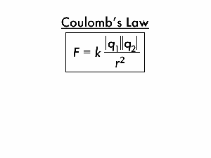

where F is the force, q1 and q2 are the charge of the two objects (usually the same when considering two electrons), and r is the radius/distance between the two charges.

Therefore, since F = qE = kqq/r^2, we can deduce that for non-uniform electric fields, the electric field strength can be calculated by

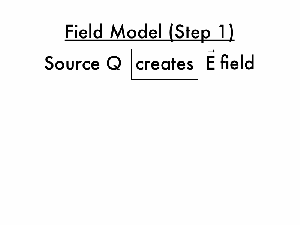

by cancelling out q (charge) on both sides.

For uniform electric fields, the electric field strength can be calculated by!

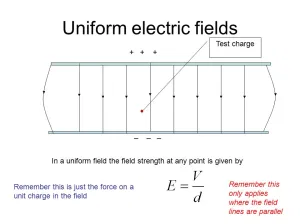

### Electric Current

The existence of an electric potential difference (see the last section of 5.1) across an object causes charges to flow through the object.

Electric current (I) refers to the rate of flow of electric charge and can be given by the equation

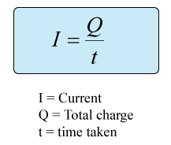

The direction of an (conventional) electric current is opposite to the direction of electron flow.

### Direct Current (DC)

Direct current (dc) is a uniform current flowing in one fixed direction in a circuit.

Direct current is usually supplied by acid-based batteries or dry cells.

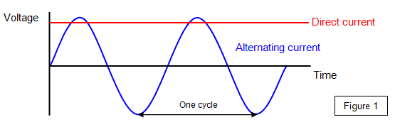

### Potential Difference

The electric potential difference (pd) between two points is equal to the work done (energy) required per unit charge to move from one point to another. It is also known as voltage (V).

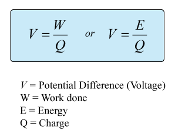

Voltage is analogical to the differences of upstreams and downstreams where water flow in the stream is the flow of electrons within the circuit.

## Heating effect of electric currents

### Circuit Diagrams

An electric circuit is an interconnection of electrical components in a closed loop.

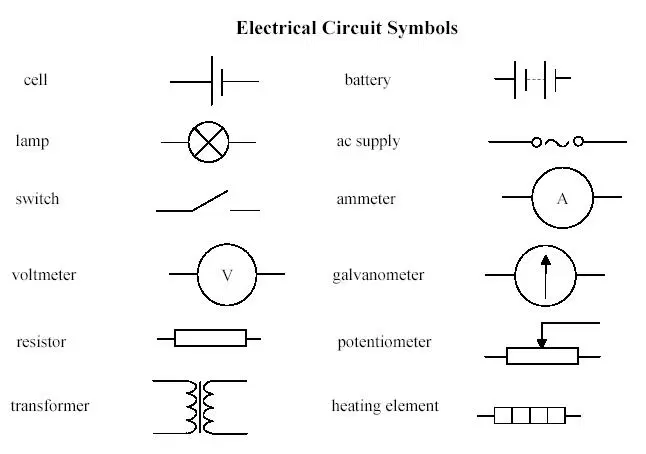

#### Resistors

A resistor is an electrical component which implements a specific resistance within an electric circuit.

A resistor with adjustable resistance is called a variable resistor.

Resistors can be connected in series or in parallel.

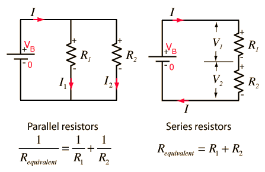

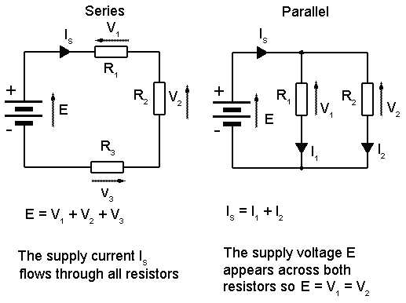

#### Voltmeters

A voltmeter is used to measure the potential difference between two points.

A voltmeter should be connected in parallel with the components being measured.

An ideal voltmeter has infinite resistance.

#### Ammeter

An ammeter is used to measure the current passing through a point.

An ammeter should be connected in series at the point of measurement.

An ideal ammeter has zero resistance.

### Kirchhoff's Circuit Laws

Kirchhoff’s junction rule is a statement of the conservation of charge flow per time. The sum of all currents flowing into a junction must equal the sum of all currents flowing out.

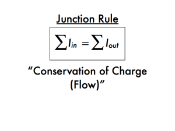

Kirchhoff’s loop rule is a statement of the conservation of electric potential energy per charge. For a complete loop of an electrical circuit all of the electric potential rises added together must equal all of the electric potential drops added together.

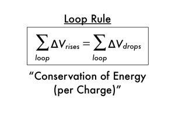

### Resistance expressed as R=V/I

The resistance (R) of an object can be seen as a measure of opposition to electric current through the object.

It is given by the ratio between the electric potential difference (V) and the current induced (I).

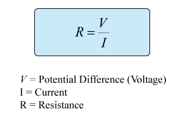

### Ohm’s law

Ohm’s law states that the current flowing through a conductor is proportional to the electric potential difference across the conductor.

-   If we plot current versus potential difference, the slope of the resulting graph is constant.

Ohm’s law is not always obeyed. A conductor which obeys Ohm’s law has a constant resistance and is called an Ohmic conductor.

A non-ohmic conductor portrays a graph that does not have a constant gradient (non-linear).

### Resistivity

The resistance of an object is proportional to its length (L) and inversely proportional to its cross-sectional area (A).

The resistance is influenced by the resistivity constant of the object (determined by the material it is made out of).

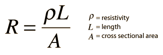

### Power Dissipation

The power (P) dissipated in a resistor can be given by

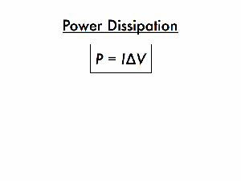

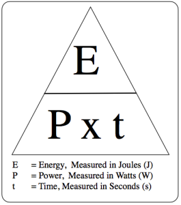

This means electrical energy is “lost” as heat energy or other forms of energy that are not considered useful over time.

## Electric cells

### Cells

A cell in a circuit acts as a source of electrical energy and creates an electric potential difference at its terminals.

A battery is made up of two cells connected.

### Internal Resistance

The internal resistance is the resistance of a source determined by the material it is made up of.

The internal resistance can be used to calculated the emf. (see the last section of 5.3)

### Secondary Cells

A secondary cell or battery can be recharged after use by passing current through the circuit in opposite direction to the current during the discharge.

### Terminal Potential Difference

The potential difference at the terminals of a source is less than the emf of the source due to internal resistance. (see the last section of 5.3)

### Electromotive Force (EMF)

The electromotive force (emf) of a source is defined as the energy per unit charge supplied by the source.

The unit for emf is volt (V).

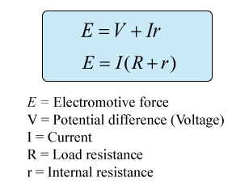

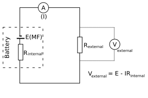

## Magnetic Effects of Electric Currents

### Magnetic Fields

Magnetic fields are caused by the presence of magnets or moving charges.

Similar to how an electric charge experiences a force in an electric field, a magnet or an electric current experiences a force in a magnetic field.

The unit of a magnetic field is Tesla (T).

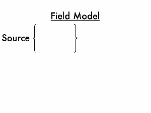

#### Magnetic field patterns

Magnetic fields can be graphically represented using magnetic field lines.

-   The direction of the field at a point is equal to the direction of the field line passing through that point.
-   The magnitude of the field at a point corresponds to the density of the field lines around that point.

Magnets

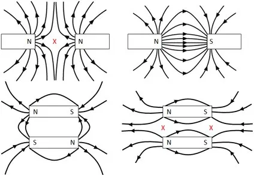

Wire with current

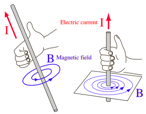

Solenoid with current

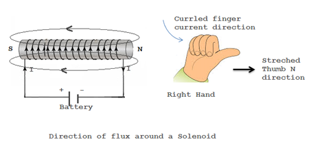

Viewing the magnetic field in 3D, dots represent magnetic fields coming out of the page (like the tip of an arrow) and crosses represent magnetic fields going into the page (like the nock of an arrow).

### Magnetic Force

The magnitude of the force acting on a current-carrying wire due to a magnetic field can be given by

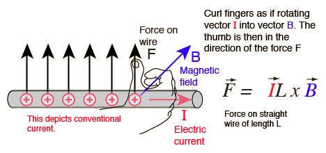

The equation may be multiplied by sinθ where θ is the angle between the direction of the field and the current. This can be ignored when θ=90 degrees because sin90 degrees equals to 1.

#### Magnetic Force on a Moving Charge

The magnitude of the force acting on a moving charge due to a magnetic field can be given by

$$
F = q\vec{B}v\sin(\theta)
$$

where F is the force acting on the wire, B is the magnetic field, q is the amount of charge, v is the velocity of the charge, and θ is the angle between the direction of the field and the velocity.

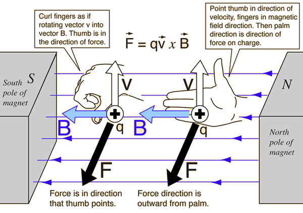

Remember that the direction of the (conventional) current is the _opposite_ to that of the flow of electrons.

As the magnetic force is always perpendicular to the velocity of the charge, it acts as a centripetal force (see topic 6) and the charge follows a circular path. No work is done on the charge by the magnetic field.

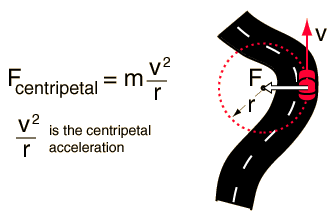

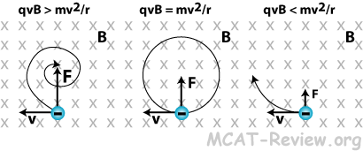
