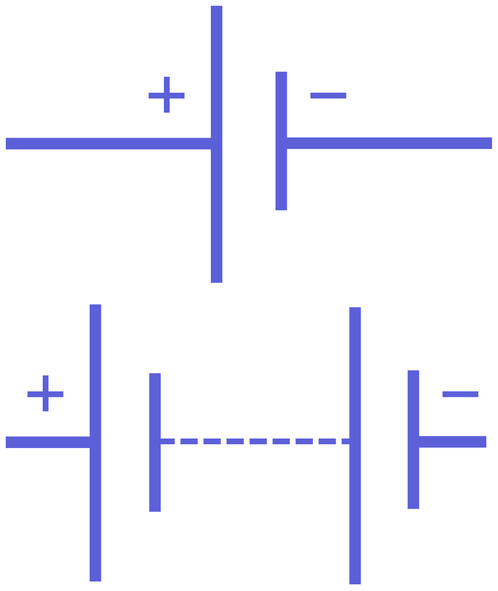

# Eectricity and Magnetism

## Electricity

### Charge

Electric charge can either be positive or negative with the symbol **Q** or **q** and is measure in Coulomb **C** which is a fundamental unit.
A fundamental charge is the charge in an electron or proton. I'ts the smallest charge known to humans.

> The charge of one electron is equal to $1.6\times 10^{-19}\ C$.

Charges with the same sign repel each other and changes with the opposite sign attract. Using a _positive test charge_ we can determine wheter an object is positively charged or negatively charged by observing whether it repels or attracts the test charge.

An object with equal amounts of positive change and negative charge is said to be electrically neutral. Positively charged objects have a deficit of electrons and negatively charged objects hava an excess of electrons.

Electric charge is always conserved. While charges could migrate from one body to another, the total charge remains the same.

#### Conductors and Insulators

Conductors are materials which allow the passage of electric charge. This is due to the presence of free electrons in solid conductors. The outter most electrons form _electron clouds_ and they are called conduction electrons.

-   Examples of conductors include all metals, graphite, humans.

Insulators are materials which do not allow the passage of electric charge.

-   Examples of insulators include wood, glass, and plastic buckets.

### Electric Field

Electric fields can be graphically represented as electric field lines.

-   The direction of the field at a point is equal to the direction of the field line passing through that point (arrows from the positive pole to the negative pole).
-   The magnitude of the field at a point corresponds to the density of the field lines around that point. Closer to the charged object has a stronger electric field and further has weaker fields.

The electric field lines curve outwards near the edge of the plates. This is known as the “edge effect”.

**Non-uniform electric field**

**Uniform electric field**

#### Electric Field Strength

Electric field strength (E) is the force per unit charge experienced by a positive test change placed in a field. It is defined as

$$
E = \frac{F_e}{q}
$$

It's quite similar to gravitational field strength which is $F_g=mg$

#### Coulomb's Law

The electrostatic force acts between all charged particles and can be attractive or repulsive. It is the charges
themselves that cause the force to exist. The force that acts between two charges, q and Q, whose centres
are separated by a distance of r is given by:

$$
F = \frac{1}{4\pi \epsilon_{0}}\times \frac{Qq}{r^2} =\frac{kQq}{r^2}
$$

where $F$ is the force, $q$ and $Q$ are the charge of the two objects (usually the same when considering two electrons), $r$ is the radius/distance between the two charges and $k$ is a calculated constant using the _permittivity of free space_ at $8.99\times 10^9\ Nm^2C^{-2}$

Therefore, since F = qE = kqq/r^2, we can deduce that for non-uniform electric fields, the electric field strength can be calculated by

> Note that charge is a vector and has direction. Here $Q$ and $q$ show the positive/negative state of the charge.

#### Chargin by Induction

We first start with a conductive object with random charges at it's drift velocity
  
Then a negatively charged object is brought close to the object. Now a seperation of charge has been induced due to attraction and repulsion.  
  
Now if the objeict is connected to groud, some negative charges will escape  
  
The ground is disconnected and the charged rod is removed, the object will be left with positive charges.

### Potential Difference (Voltage)

The electric potential difference (pd) between two points is equal to the work done (energy) required per unit charge to move from one point to another. It is also known as voltage (V). It is the measure of the energy(in joules) per unit charge(in coulombs):

$$
V=\frac{E}{q}
$$

Voltage is analogical to the differences of upstreams and downstreams where water flow in the stream is the flow of electrons within the circuit.

### Electromotive Force (EMF)

The electromotive force (EMF) of a source is defined as the energy per unit charge supplied by the source. The unit for EMF is volt (V). EMF is essentially the Voltage of the system including the internal voltage drop of the source.

$$
\begin{aligned}
&\mathcal{E}=V+I r \\
&\mathcal{E}=I(R+r)
\end{aligned}
$$

where $\mathcal{E}=$ Electromotive force, $\mathrm{V}=$ Potential difference (Voltage), $I=$ Current, $\mathrm{R}=$ Load resistance and $r=$ Internal resistance

### Electric Current

The existence of an electric potential difference across an object causes charges to flow through the object. Electric current (I) refers to the rate of flow of electric charge. It's measure in _Ampers_ (A) and can be given by the equation

$$
I=\frac{Q}{t}
$$

The direction of an (conventional) electric current is opposite to the direction of electron flow due to convention.

#### Current Carrying Conductors

Initially electrons in a conductor travels at the _random drift velocity_. To move them, positive charges are used to attract negatively charged electrons to create movement.  
The current that passes through the conductor is:

$$
I=nAvq
$$

where $n$ is the charge density which is the number of charge carriers per unit volume, $A$ is the cross sectional area, $v$ is the ramdom drift velocity and $q$ is the charge per charge carrier.

### Power

Power is the work done per unit time measured in Watts. Recall that

$$
V=\frac{E}{Q} \\
I=\frac{Q}{t}
$$

and if we multiply the Voltage and Current we get

$$
V\times I= \frac{E}{Q}\times \frac{Q}{t} = \frac{E}{t}=P
$$

Due to this relationship, the following equations also stand true:

$$
P=IV=I^2R=\frac{V^2}{R}
$$

> The amount of work done to make an electron go through a potential difference of 1V is known as the "electron volt" or $eV$. It is found using $eV=VQ=1V\times 1.6\times 10^{-19}$

### Circuits

An electric circuit is an interconnection of electrical components in a closed loop.

#### Circuit Diagrams

A basic circuit consists of the power source which creates the EMF and components that create resistance.

List of usefull electrical components:

##### Resistors

A resistor is an electrical component which implements a specific resistance within an electric circuit.

A resistor with adjustable resistance is called a variable resistor.

Resistors can be connected in series or in parallel.

##### Voltmeters

A voltmeter is used to measure the potential difference between two points.

A voltmeter should be connected in parallel with the components being measured.

An ideal voltmeter has infinite resistance.

##### Ammeter

An ammeter is used to measure the current passing through a point.

An ammeter should be connected in series at the point of measurement.

An ideal ammeter has zero resistance.

#### Ohm’s law

Ohm’s law states that the current flowing through a conductor is proportional to the electric potential difference across the conductor $V\alpha I$

Ohm’s law is not always obeyed. A conductor which obeys Ohm’s law has a constant resistance and is called an Ohmic conductor.

A non-ohmic conductor portrays a graph that does not have a constant gradient (non-linear).

#### Resistance

Resistance is defined by [Ohm's Law](#ohms-law) as

$$
R=\frac{V}{I}
$$

> Note that resistance is **NOT** defined as "how hard" current travels through a circuit or what not

To find resistance, do **NOT** calculate the slope of $V$ over $I$ as resistance is not defined as $\frac{\Delta V}{\Delta I}$. Calculate the resistance at each individual data point and calculate the arithmetic maen.

Resistance is cuased by electrons imparting energy to the atoms of the material which makes them vibrate faster. This increase in vibration impedes the flow of electrons.

#### Resistivity

Resistivity is the property of a material that causse it to oppose a current. It's measured in Ohm-Meters ($\omega m$) It can be calculated by:

$$
\rho = \frac{RA}{l}
$$

Where $R$ is the resistance, $A$ is the cross sectional area and $l$ is the length of the conducting material.

#### Simple Circuits

##### Voltage Devider

A voltage devider or potential devider is a circuit that uses resistors to devide one power source into smaller potential differences.

The resultant voltage can be found using Ohm's Law. In many cases, the ration of the two resistors will determine the voltage outputs.

##### Rheostat - Variable Resistor

A variable resistor is a resistor in which it's resistance can be changed. Often, a fillament is used and a selector is attached to select parts of the fillament for the current to pass through.  

##### Potentiometre

A potentiometer varies the voltage very much like the [voltage devider](#voltage-devider). Here a selector clamps on sections of a fillament thats connected to a power source which we can vary how much material is included which will change the voltage accross the component due to $V=IR$

#### Kirchhoff's Circuit Laws

Kirchhoff’s junction rule is a statement of the conservation of charge flow per time. The sum of all currents flowing into a junction must equal the sum of all currents flowing out.

$$
\sum{I_{in}} =\sum{I_{out}}
$$

Kirchhoff’s loop rule is a statement of the conservation of electric potential energy per charge. For a complete loop of an electrical circuit all of the electric potential rises added together must equal all of the electric potential drops added together.

$$
\sum_{\text {loop }} \Delta V_{\text {rises }}=\sum_{\text {loop }} \Delta V_{\text {drops }}
$$

##### Usage of Kirchhoff's Circuit Laws

We can use Kirchoff's Circuit Laws to find the voltage, current and power accross a resistor in a circuit with two power sources.
Here are a set of rules based on Kirchoff's Laws:

1. Follow the direction of conventional current (from - to +)
2. if a power source's negative terminal is encountered, there will be a **potential rise**
3. if a power source's positive terminal is encountered, there will be a **potential drop**
4. if a current is encountered in the same direction as the travelling current, there will be a **potential drop of $I\times R$**
5. if a current is encountered in the opposite direction as the travelling current, there will be a **potential rise of $I\times R$**

The best way to approach is to first start on the negative side of each power source and draw the current path following conventional current.
Here's an example:

**following yellow**

1. Potential rise of $V_A$
2. Potential drop of $I_A\times 4$
3. Potential rise of $I_B\times 5$ due to encountering current in opposite direction
4. Potential drop of $I_A\times 5$
5. Potential drop of $I_A\times 2$

**following orange**

1. Potential rise of $V_B$
2. Potential drop of $I_B\times 6$
3. Potential rise of $I_A\times 5$ due to encountering current in opposite direction
4. Potential drop of $I_B\times 5$
5. Potential drop of $I_B\times 10$

In the end, both loops must result with a potential difference of 0. Thus we can solve for $I_A$ and $I_B$.

We can also follow the total loop and equate that to 0.

**following green**

1. Potential rise of $V_A$
2. Potential drop of $I_A\times 4$
3. Potential drop of $I_B\times 10$
4. Potential rise of $V_B$
5. Potential drop of $I_B\times 6$
6. Potential drop of $I_A\times 2$

### Electric cells

#### Cells

A cell in a circuit acts as a source of electrical energy and creates an electric potential difference at its terminals.

A battery is often made up of two or more cells connected.

#### Internal Resistance

The internal resistance is the resistance of a source determined by the material it is made up of. Any material that makes power has internal resistance, this includes batteries, power supplies, power genrators etc.
  
The potential difference at the terminals of a source is less than the EMF of the source due to internal resistance which can be used to calculated the EMF since EMF includes both internal and external resistance.

##### How to Measure Internal Resistance

Since we cannot go into a power source and maesure the resistance, we can estimate it using data.

In this setup, we know that EMF is equal to the internal resistance times the current plus the terminal voltage. By measuring the current and terminal voltage, we can find the internal resistance if we graph data points of terminal voltage against current. When terminal voltage is 0, EMF is also 0 thus we can find the internal resistance.

> Note that a good voltmeter(multimeter these days) can measure EMF pretty well since they have a really large internal resistance and a very small current. Thus the measured voltage is very close to EMF.

## Magnetism

### Magnetic Fields

Magnetic fields are caused by the presence of magnets or moving charges.

Similar to how an electric charge experiences a force in an electric field, a magnet or an electric current experiences a force in a magnetic field.

The unit of a magnetic field is Tesla (T) with the symbol $\vec{B}$ and is $1\ kg\cdot s^{-2}\cdot A^{-1}$ in SI units.

By convention, the direction of magnetic field is always from **North to South**

A single magnetic domain is the smallest magnet. If all small magnetic domains align, it craetes a larger magnetic field.

#### Magnetic Field Patterns

Magnetic fields can be graphically represented using magnetic field lines.

-   The direction of the field at a point is equal to the direction of the field line passing through that point.
-   The magnitude of the field at a point corresponds to the density of the field lines around that point.

Magnets

Wire with current

Viewing the magnetic field in 3D, dots represent magnetic fields coming out of the page (like the tip of an arrow) and crosses represent magnetic fields going into the page (like the nock of an arrow).

#### Magnetic Field Strength

The magnetic field strength is proportional to the current that passes through the conductor and is inversly porportional to the radial distance in which the field is measured.

The magnetic field strength can be calculated using the following formula:

$$
\vec{B}=\frac{\mu_{0}I}{2\pi r}
$$

where $\mu_{0}$ is the permiability of free space which is $4\pi\times 10^{-7}\cdot T\cdot m\cdot A^{-1}$, $I$ is the current, and $r$ is the radial distance.

#### Right Hand Rule

To find the direction in which the magnetic field is pointing, the right hand rule is used. Using the right hand, we use the thumb to point towards the direction of the current and dircetion the four other fingers point is the direction of the magnetic field.

### Magnetic Force

#### Complete Right Hand Rule

Another right hand rule can help us find the direction of the force on a conductor in a magnetic field. To do so:

1. Line up four fingers with the magnetic field
2. Align thumb with the directin of conventional current
3. The direction of the inner palm is the direction of the force.

If the angle between the conductor and field is not $90\degree$, if the thumb is pointing up, the direction is pointing outwards and vice verca.

#### On a Conductor

The magnitude of the force acting on a moving charge due to a magnetic field can be given by

$$
F = Il\vec{B}\sin(\theta)
$$

where F is the force acting on the wire, I is the current through the conductor ,l is the length of conductor in the field, and θ is the angle between the direction of the field and the conductor.

#### On a Point Charge

The force a magnetic force on a point charge through a magnetic field is found by:

$$
\begin{align*}
F &= \frac{q}{t}l\vec{B}\sin{\theta}\\
&= vq\vec{B}\sin{\theta}
\end{align*}
$$

  
where $q$ is the charge of the particle(often its $1.6\times 10^{-19}$ for proton/electron), $v$ is the velocity the particle is traveling at, $\vec{B}$ is the magnetic field and $\theta$ is the angle between the magnetic fields and the directon of the velocity.

> Note that to find the direction of the force, the Right Hand Rule can still be used but make sure to **flip** the direction of velocity(thumb) if the point charge is negative.
> 

#### Balancing Magnetic Field

The charge will not travel in a straight line in an electrical field but we can balance that with another magnetic field.  
First, a electron gun will shoot out an electron using a potential difference:
  
It travels through a electric field created by $V_p$ with velocity $v$ and we add a magnetic field with the force $F_B$ countering the attraction of $F_e$.
  
In order for the electron to travel straight:

$$
\begin{align*}
F_e &= F_B\\
qE &= qv\vec{B}\sin{\theta}\\
E &= v\vec{B}\\
\frac{E}{B}&=v=\sqrt{\frac{2V_A}{m}}\\
\frac{q}{m}&=\frac{E^2}{2B^2V_A}
\end{align*}
$$

This is how we fould the ratio of charge to mass of an electron. (J.J. Tomson)
