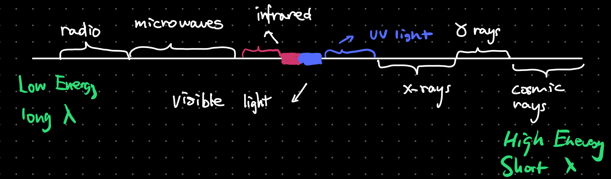

# Unit 4: Waves

## Oscillations, Vibrations and Waves

When an object vibrates back and forth or up and down with a regular repeating motion we describe it as oscillations. A pendulum, a mass attacked to a spring are examples of oscillation.  

### Properties of oscillation

- **Displacement (x)**: The distance from the equilibrium position at an instant in time measured in metres, m.
- **Amplitude (A)**: The amplitude of an oscillator is the maximum displacement of the particles from the equilibrium position measured in metres, m.
- **Period (T)**: The (Time) period is the time it takes for one complete oscillation to happen often measured as the time it takes to oscillates from one point back to the same point in the next cycle. Period is in seconds, s.
- **Frequency (f)**: Frequency is a measure of how often something happens, in this case how many complete oscillations occurs in one second. It's liked to period of the wave by the following equation: $T=\frac{1}{f}$ or $f=\frac{1}{T}$ Frequency is measure in Hertz, Hz
- **Phase Difference**: The measure of how "in step" different particles are. If they are moving together they are said to be in phase. If not they are said to be out of phase. Phase difference is measured in radians, rad.

## Simple Harmonic Motion

In each of the simple harmonic motion oscillators shown above, the object is oscillating back and forth or up and down with a **constant** time period.

### SMH Characteristics

The equilibrium point is where the object comes to rest. If we displace the object by $x$ metres there will be a force that brings the object back to the equilibrium point. We can represent this as

$$
F\ \alpha-x
$$

Since $F=ma$ and the mass of the object is constant, we can also write

$$
a\ \alpha-x
$$

Thus we can see that for an object to be moving in SMH:

1. The acceleration is proportional to the displacement
2. The acceleration is always towards the equilibrium (opposite to the displacement)

This means if we graph the acceleration $a$ against displacement $x$ we will get the following graph  

### Equations for SMH

The following equations are for all SHM systems but consider a simple pendulum and a mass on a spring hanging from the ceiling.

#### Period

The period of a SHM depends on the type of SHM system but in the case of a pendulum the equation for the period is

$$
T=2\pi\sqrt{\frac{l}{g}}
$$

where $l$ is the length of the string attacked to the mass and $g$ the gravitational constant.  
However, the period in a SHM where a mass is attached to a string, the period is calculated as

$$
T=2\pi\sqrt{\frac{m}{k}}
$$

where $m$ is the mass and $k$ is the spring constant.
Looking at a mass attached to a spring, we can also use `Hooks Law` to see that the acceleration is in fact proportional and opposite to displacement

$$
\begin{align*}
F&=-kx\\
F&=ma\\
a &= -\frac{k}{m}x
\end{align*}
$$

#### Displacement

The displacement of the mass on the pendulum or the spring $x$ is given by the equation

$$
x = A\cos{2\pi ft}
$$

and since frequency $f=\frac{1}{T}$, the equation can also become

$$
x = A\cos{2\pi\frac{t}{T}}
$$

Where $t$ is the time into the cycle and $T$ is the period for one complete cycle and $A$ is the amplitude of the wave.

#### Velocity

The velocity of the mass at displacement $x$ can be calculated by

$$
v = \pm2\pi f\sqrt{A^2-x^2}
$$

Maximum velocity occurs when the pendulum is at equilibrium (lowest point) or the mass on the spring is at equilibrium (middle) where displacement is 0.

#### Acceleration

The acceleration of the mass at displacement $x$ is given by

$$
a = -(2\pi f)^2x
$$

We can see that acceleration is always the opposite direction of displacement. Maximum acceleration occurs at the end of the swings in a pendulum and at the highest and lowest point of the mass on a spring when displacement is equal to the Amplitude.

### SHM Graphs

When released from A the bob accelerates and moves to the centre point. When it reached B it has reached a maximum velocity in the positive direction and then begins to slow down. At C it has stopped completely so the velocity is zero, it is at a maximum displacement in the positive and accelerates in the negative direction. At D it is back to the centre point and moves at maximum velocity in the negative direction. By E the velocity has dropped to zero, maximum negative displacement and a massive acceleration as it changes direction. This repeats as the pendulum swings through F, G, H and back to I.  
  
Below are the graphs of displacement, velocity and acceleration:  

#### Gradients of the Graph

- Since $v=\frac{\Delta x}{\Delta t}$, the gradient of the displacement time graph gives us the velocity. The velocity graph is the derivative of the displacement graph. As shown, the gradient at point A,C,E,G,I are all 0 thus velocity is also 0.
- Since $a=\frac{\Delta v}{\Delta t}$, the gradient of the velocity time graph gives us the acceleration. The acceleration graph is the derivative of the velocity time graph. As shown, at points B,D,F,H the gradient of velocity graph is 0 thus acceleration is 0.

#### Energy in SHM

When talking about Energy and Waves:

1. All waves require a medium to travel except Electromagnetic Waves
2. The speed of a wave is the speed which energy is transferred. It only depends on the medium.
3. Traveling waves transmit energy.

In all simple harmonic motion systems,there is a conversion between kinetic energy and potential energy. The total energy of the system remains **constant**. (This is only true for isolated systems) For a simple pendulum there is a transformation between kinetic energy and gravitational potential energy.

At its lowest point it has minimum gravitational and maximum kinetic, at its highest point (when displacement is a maximum) it has no kinetic but a maximum gravitational. This is shown in the graph.

For a mass on a spring there is a transformation between kinetic energy, gravitational potential energy and the energy stored in the spring (elastic potential). At the top there is maximum elastic and gravitational but minimum kinetic. In the middle there is maximum kinetic, minimum elastic but it still has some gravitational. At its lowest point it has no kinetic, minimum gravitational but maximum elastic.  

Below is a graph of the energy of the mass graphed with displacement over time:

As shown, the energy of the system is proportional to the amplitude squared $E\ \alpha A^2$ and **NOT** the frequency counter to popular belief.

## Traveling Waves

Traveling waves transport energy from one area of space to another, whereas standing waves do not transport energy. Traveling waves are not confined to a given space along the medium like an ocean wave.

### Longitudinal Waves

Here is a longitudinal wave; the oscillations are parallel to the direction of propagation (travel). Think about a slinky or sound waves.

Where the particles are close together, we call a **compression** and where they are spread, we call a **rarefaction**. The wavelength is the distance from one compression or rarefaction to the next. The amplitude is the maximum distance the particle moves from its equilibrium position to the right of left.  
An example of this would be sound waves. A sound wave approximately travels at $343.2\ ms^{-1}$ at $20\degree C$.  

### Transverse Waves

Here is a transverse wave; the oscillations are perpendicular to the direction of propagation. Think about a string. Where the particles are displaced above the equilibrium position, we call a **crest** and below we call a **trough**. The wavelength, $\lambda$, is the distance from one peak or trough to the next. The amplitude is the maximum distance the particle moves from its equilibrium position up or down.
An example would be water waves or EM waves.

### Electromagnetic Spectrum

Electromagnetic waves are transverse waves produced by oscillating and magnetically fields. It doesn't need a medium to transfer energy. The image below shows the EM spectrum from low frequency, low energy, long wavelength to high frequency, high energy and short wavelength.

EM waves have two components, a vertical and horizontal component. The vertical component is often the Electric component and horizontal the Magnetic component. All EM waves travel at the speed of light $3.8 \times 10^8\ ms^{-1}$.

### The Universal Wave Equation

The wave speed of a wave $v$, it’s frequency $f$ and it’s wavelength $\lambda$, are related by the equation:

$$
V=f\lambda
$$

Where $V$ is the speed of the wave in $ms^{-1}$, frequency in $Hz$ and wavelength in $m$.

### Wave Characteristics

#### Wavefronts and Rays

- **Wavefronts**: are lines joining points which vibrate in phase with each other. Wavefronts can be straight lines or curves and the distance between successive wavefronts is the wavelength of the wave.
- **Rays**: are lines that indicate the direction of a wave propagation. They are always perpendicular to wavefronts.

#### Amplitude and Intensity

The intensity is defined as the power per unit area $\frac{P}{A}$ and is measured in $wm^{-2}$.  
The amplitude and intensity of the wave is corelate to the energy the wave has. The intensity of the wave is proportional to the square of it's amplitude thus $I\alpha A^2$. This is the inverse square law.  

#### Polarization

> Only transverse waves can be polarized.

Polarization restricts the oscillations of a transverse wave to one plane. In the diagrams, the light is initially oscillating in all directions perpendicular to the wave direction. A piece of Polaroid only allows light transmission in one plane, filtering out oscillations in other oscillations.

This is proof that the waves of the EM spectrum are transverse waves. If they were longitudinal waves the forwards and backwards motion would not be stopped by crossed pieces of Polaroid; the bottom set up would emit light.

##### Malu's Law

Malu's law states that the intensity of plane-polarized light that passes through an analyzer varies as the square of the cosine of the angle between the plane of the polarizer and the transmission axes of the analyzer defined by

$$
I = I_0 \cos^2{\theta}
$$

##### Usages of Polarization

Polarization can be used to analyze optically active substances which rotates the plane of polarization such as sugar. The sweetness of the sugar is reflected by the intensity that passes through.

Another use case is LCD or Liquid Crystal Displays. The liquid crystal will change is polarization when electricity is applied and thus being able to be seen through another polarizing film.

#### Superposition

Superposition is the process by which two waves combine into a single wave form when they overlap. If we add these waves together the resultant depends on where the peaks of the waves are compared to each other.  

Here are three examples of what the resultant could be: a wave with an **amplitude of 1.5**, **no resultant wave at all** and a wave with an **amplitude of 2.0**  

**Path Difference**: If two waves from the same source arrive at a point having taken a different path (Eg one of them reflected), they may have traveled different distances from the source. This difference in journey is called the path difference.

The path difference directly impacts how the wave superpositions itself with the other wave. If the path difference is equal to a whole number of wavelengths ($PD=λ, 2λ, 3λ, 4λ…$), the two waves will be in phase at this point and constructive interference will be observed (addition of amplitudes). If the path difference is a multiple of half a wavelength ($PD=0.5λ, 1.5λ, 2.5λ,3.5λ…$), the two waves will be in anti-phase at that point ("out of phase") and destructive interference will be observed (reduction of amplitude/cancellation).

### Wave Behaviors

#### Reflection

#### Refraction

#### Superposition Interference

Superposition is explained previously [here](#superposition).

#### Diffraction

## Standing Waves
